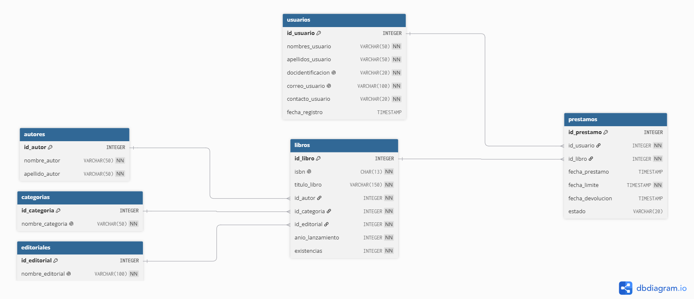

# 📚 Sistema de Gestión de Biblioteca


## Descripción

Este proyecto consiste en un sistema de gestión de biblioteca desarrollado en Python utilizando PostgreSQL como sistema gestor de bases de datos. El objetivo del proyecto es administrar de manera sencilla los recursos de una biblioteca mediante operaciones CRUD, consultas avanzadas y control de préstamos.

El proyecto fue desarrollado siguiendo una arquitectura organizada por módulos, separando la lógica de negocio, el acceso a datos y los modelos para facilitar su mantenimiento y escalabilidad.

##  Características

- Gestión completa de libros.
- Gestión de autores.
- Gestión de categorías.
- Gestión de editoriales.
- Gestión de usuarios.
- Gestión de préstamos.
- Búsqueda de libros por nombre.
- Búsqueda de registros por ID.
- Consulta de libros disponibles.
- Consulta de libros agotados.
- Consulta de libros por autor.
- Registro de préstamos de libros.
- Registro de devoluciones de libros.
- Listado de préstamos activos.
- Listado de préstamos vencidos.
- Validación de datos de entrada.
- Confirmación de operaciones antes de eliminar registros.

## Tecnologías utilizadas

- Python 3
- PostgreSQL
- psycopg
- SQL
- Visual Studio Code

##  Estructura del proyecto

```BibliotecaCRUD/
│
├── src/
│     ├── database/
│     │     ├── connection.py
│     │     ├── config.py
│     │     ├── schema.sql
│     │     └── seed.sql
│     │
│     ├── menus/
│     │     ├── menu_autores.py
│     │     ├── menu_editoriales.py
│     │     ├── menu_libros.py
│     │     ├── menu_prestamo.py
│     │     ├── menu_principal.py
│     │     └── menu_usuarios.py
│     │
│     ├── models/
│     │     ├── autor.py
│     │     ├── categoria.py
│     │     ├── editorial.py
│     │     ├── libro.py
│     │     ├── prestamo.py
│     │     └── usuario.py
│     │
│     ├── repositories/
│     │     ├── autor_repository.py
│     │     ├── categoria_repository.py
│     │     ├── editorial_repository.py
│     │     ├── libro_repository.py
│     │     ├── prestamo_repository.py
│     │     └── usuario_repository.py
│     │
│     └── utils/
│           └── validaciones.py
├── main.py
│
├── README.md
│
└── requirements.txt

```


## Funcionalidades implementadas

## Libros

- Crear libro.
- Listar libros.
- Buscar libro por ID.
- Buscar libro por nombre.
- Buscar libro por autor.
- Buscar libro por editorial.
- Actualizar libro.
- Eliminar libro.
- Mostrar libros agotados.
- Mostrar libros disponibles.

## Autores

- Crear autor.
- Listar autores.
- Buscar autor por ID.
- Actualizar autor.
- Eliminar autor.

## Categorías

- Crear categoría.
- Listar categorías.
- Buscar categoría por ID.
- Actualizar categoría.
- Eliminar categoría.

## Editoriales

- Crear editorial.
- Listar editoriales.
- Buscar editorial por ID.
- Actualizar editorial.
- Eliminar editorial.

## Usuarios

- Crear usuario.
- Listar usuarios.
- Buscar usuario por ID.
- Actualizar usuario.
- Eliminar usuario.

## Préstamos

- Registrar préstamo.
- Registrar devolución.
- Listar préstamos.
- Listar préstamos vencidos.
- Buscar prestamo por ID.
- Actualizar prestamo.
- Eliminar prestamo. 

## Consultas

- Libros disponibles.
- Libros agotados.
- Buscar libros por autor.
- Buscar libros por categoría.


## Base de datos

El proyecto utiliza PostgreSQL con relaciones entre las siguientes tablas:

- Autores
- Categorías
- Editoriales
- Libros
- Usuarios
- Préstamos

Las relaciones se implementan mediante claves foráneas para garantizar la integridad de la información.

## Requisitos
- Python 3.14 o superior
- PostgreSQL
- psycopg

## Instalación

1. Clona el repositorio.

```bash
git clone https://github.com/CristianRvs7/biblioteca-crud-python.git
```

2. Entra al proyecto.

```bash
cd BibliotecaCRUD
```

3. Instala las dependencias.

```bash
pip install -r requirements.txt
```

> O bien:

```bash
pip install psycopg
```

4. Configura la conexión a PostgreSQL en `config.py`.

5. Ejecuta los scripts de la base de datos.

```sql
schema.sql
seed.sql
```

6. Inicia la aplicación.

```bash
python src/main.py
```

## Objetivos del proyecto

Este proyecto fue desarrollado con fines de aprendizaje para fortalecer conocimientos en:

- Python.
- Programación orientada a objetos.
- SQL.
- PostgreSQL.
- Arquitectura por capas.
- Operaciones CRUD.
- Relaciones entre tablas.
- Validación de datos.
- Organización de proyectos en Python.


## Mejoras futuras

- Historial de préstamos por usuario.
- Ranking de libros más prestados.
- Sistema de autenticación.
- API REST con FastAPI.
- Interfaz web.
- Documentación de la API.
- Pruebas automatizadas.
- Contenerización con Docker.


## Diagrama de la base de datos




## Autor

Cristian Riquelmi Umaña Rivas.  

Proyecto desarrollado como parte de mi proceso de formación en desarrollo Backend con Python y PostgreSQL.